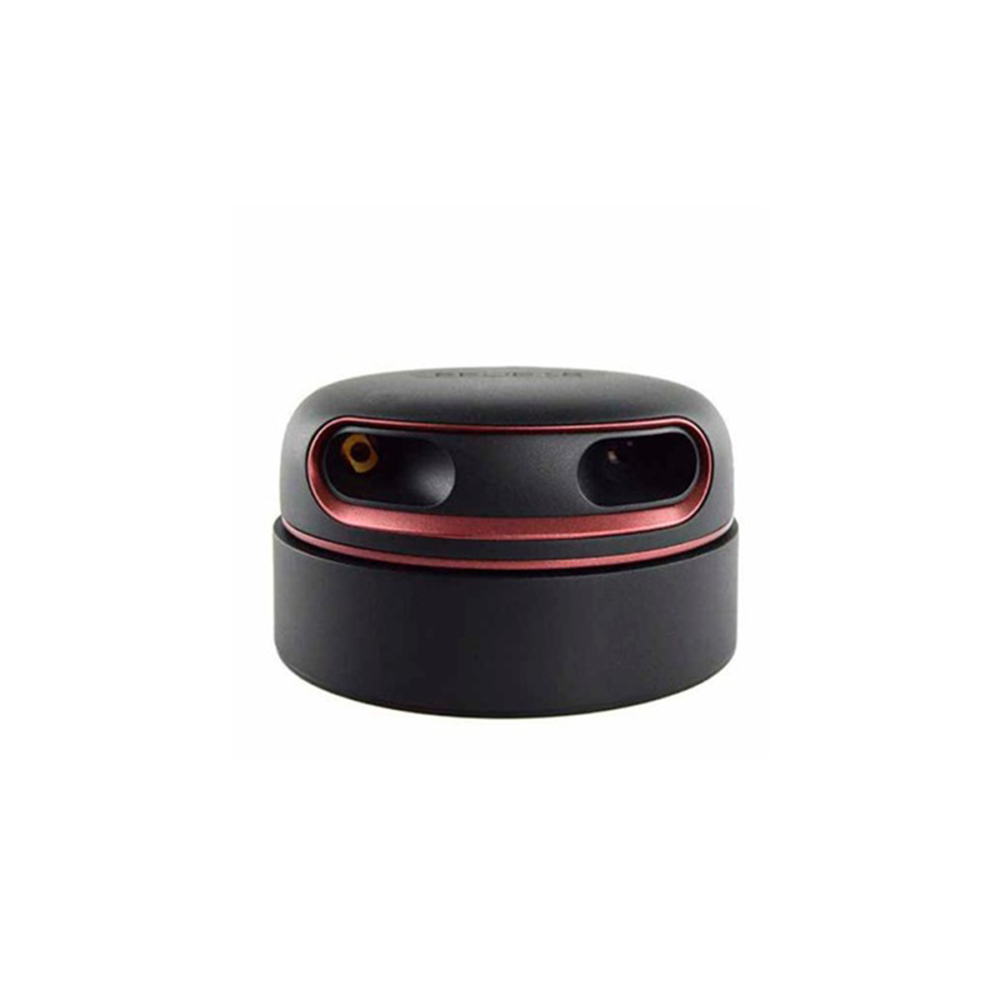
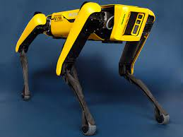

# Cogniteam Component library for ROS noetic
This library contains open dockerized components for ROS
If you wish to use ROS2 check out our [ROS2 library](https://github.com/cogniteam/Library.Components.ROS2/tree/master)
# ROSCon 2023 

To participate in the contest and stand a chance to win a [Leo Rover](https://www.leorover.tech/), start by forking our library. Following this, you have two options to proceed:

1. Initiate a merge request to include a folder containing your component's Dockerfile. For guidance on this, please [refer to these instructions](#option-1-add-a-folder-with-your-components-dockerfile).
   
2. Create a merge request to add your git repository details to the `ContributedComponents.MD` file. Detailed steps can be found [here](#option-2-add-your-git-repository-to-contributedcomponentsmd).
# Cogniteam’s Components Table
Image | Link
--- | ---
 | [aruco-code-detection](components/aruco-code-detection)
 | [audio_say](components/audio_say)
 | [autopilot_bridge](components/autopilot_bridge)
 | [caffe-object-detection](components/caffe-object-detection)
 | [cartographer-slam](components/cartographer-slam)
 | [cogniteam-anomaly-detection](components/cogniteam-anomaly-detection)
 | [cogniteam-merge-videos](components/cogniteam-merge-videos)
 | [cogniteam-random-goals](components/cogniteam-random-goals)
 | [custom-message-listener](components/custom-message-talker-listener)
 | [custom-message-talker](components/custom-message-talker-listener)
 | [custom-service-server](components/custom-ros-service)
 | [custom-service-client](components/custom-ros-service)
 | [deegoo-fpv-gps](components/deegoo-fpv-gps)
 | [faces-landsmarks-mediapipe](components/faces-landsmarks-mediapipe)
 | [generic-webcam-with-mic](components/generic-webcam-with-mic)
 | [hamster-wandering](components/hamster-wandering)
 | [hands_pose_detection](components/hands_pose_detection)
 | [image-topic-to-rtsp](components/image-topic-to-rtsp)
 | [imu-filter-madgwick](components/imu-filter-madgwick)
 | [joystick-teleop-twist](components/joystick-teleop-twist)
 | [leg-detector](components/leg-detector)
 | [nextVision_cam](components/nextVision_cam)
 | [path-publisher](components/path-publisher)
 | [path-waypoints-navigation](components/path-waypoints-navigation)
 | [richbeam-lakibeam](components/richbeam-lakibeam)
 | [ros-serial-st-python](components/ros-serial-st-python)
 | [ros-tutorials-listener](components/ros-tutorials-listener)
 | [ros-tutorials-talker](components/ros-tutorials-talker)
 | [ros1-gateway-arm32](components/ros1-gateway-arm32)
 | [ros1-gateway-launch](components/ros1-gateway-launch)
 | [sick-safety-nanoscan3](components/sick-safety-nanoscan3)
 | [rplidar-a1](components/slamtec-rplidar-driver)
 | [rplidar-a3](components/slamtec-rplidar-driver)
 | [rplidar-a2](components/slamtec-rplidar-driver)
 | [rplidar-s1](components/slamtec-rplidar-driver)
 | [rplidar-s2](components/slamtec-rplidar-driver)
 | [spot-bridge](components/spot-bridge)
 | [stm-remote-burn](components/stm-remote-burn)
 | [tflite-object-detection](components/tflite-object-detection)
 | [turtlebot3-lidar](components/turtlebot3)
 | [turtlebot3-picamera](components/turtlebot3)
 | [turtlebot3-driver](components/turtlebot3)
 | [turtlebot3-slam](components/turtlebot3)
 | [turtlebot3-navigation](components/turtlebot3)
 | [vosk-speech-to-text](components/vosk-speech-to-text)

# Contributed Components Table 
Image | Link
--- | ---
 | [ROS-YDLidar-x4](https://github.com/ptrks/ROS-YDLidar-x4-docker)
# Contribution
 If you wish to contribute by adding a new component to our library as part of our ongoing competition, please follow the instructions below:

 ## Prerequisites

Before you begin, ensure you have met the following requirements:

- You have a [GitHub](https://github.com) account.
- You have installed [Git](https://git-scm.com/).
- You have installed [Docker](https://www.docker.com/get-started).

## Forking and Cloning the Repository

1. **Fork the Repository**: Click on the 'Fork' button on the upper right-hand side of the page. A copy of the repository will be created on your personal GitHub account.
2. **Clone the Repository**: Clone the forked repository to your local machine by running:
   ```bash
   git clone https://github.com/cognimbus/Nimbus.Library.Components.ROS.git
   ```

## Adding a New Component

### Option 1: Add a folder with your component's Dockerfile

#### 1. **Prepare Your Component Structure**
   - `comp_name`: Directory for your component
      - `docker`: Contains code and the Docker file
      - `img_file`: image represents the component

#### 2. **Create and Test Your Dockerfile**
   - Navigate to the cloned repository on your local machine.
   - Create a new Dockerfile with the required configurations for the ROS/ROS2 application you wish to containerize.
   - Test your Dockerfile locally with:
     ```bash
     docker build -t ros_app:<tag> .
     docker run --rm -it ros_app:<tag>
     ```

#### 3. **Place Your Files in the Directory Structure**
   - Place the Dockerfile and code into the appropriate directory structure within `comp_name/docker`.

#### 4. **Commit Your Changes**
   - After testing, commit your changes:
     ```bash
     git add .
     git commit -m "Your detailed commit message"
     ```
### Option 2: Add your git repository to ContributedComponents.MD

If you already have a git repository with a Dockerfile, simply add a link in ContributedComponents.MD and request to merge it. Make sure to add a relevant image from your git and make sure your git includes a valid Dockerfile that uses this version of ROS. 

#### Step 1: Prepare Your Image and Repository URL

Before adding a new row to the table, make sure you have the following:

1. **Image URL**: The URL of the image that represents your component. This should be hosted inside your Git repository. You can obtain the URL by navigating to the image file in your Git repository (e.g., on GitHub) and copying the URL.
   
2. **Repository URL**: The URL of your Git repository where the component is hosted.

#### Step 2: Add a New Row to the Table

To add a new component to the table, follow these steps:

1. **Open the Markdown File**: Open the markdown file where the table is located.

2. **Add a New Row**: Add a new row to the table with the following format:

   ```markdown
   Image | Link
   --- | ---
    | [COMPONENT_NAME](REPOSITORY_URL)
   ```

3. **Replace Placeholders**: Replace `IMAGE_URL`, `COMPONENT_NAME`, and `REPOSITORY_URL` with the actual values:
   
   - `IMAGE_URL`: The URL of the image you prepared in step 1.
   - `COMPONENT_NAME`: The name of your component.
   - `REPOSITORY_URL`: The URL of your Git repository.

## Submitting a Merge Request

1. **Push Your Changes**: Push to your forked repository:
   ```bash
   git push origin <ros-distro>
   ```
2. **Create a Pull Request**: Navigate to your forked repository's GitHub page, click 'Pull request', and write a detailed comment.
3. **Submit**: Click 'Submit pull request'.

## Support and Contact

If you have questions or encounter issues, open an issue in the repository, and one of our maintainers will get back to you as soon as possible. Thank you for your contribution!

---

- [Nimbus Library Components for ROS](https://github.com/cognimbus/Nimbus.Library.Components.ROS)
- [Nimbus Library Components for ROS2](https://github.com/cognimbus/Nimbus.Library.Components.ROS2)