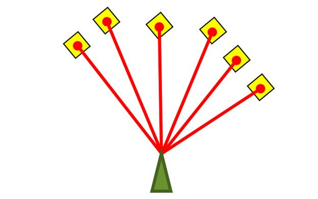

# Amcl



* Dockerhub image https://hub.docker.com/r/cognimbus/amcl
* Supported architectures <b>arm64/amd64</b>
* ROS version <b>melodic
</b>

# Short description
* Amcl is a probabilistic localization system for a robot moving in 2D. It implements the adaptive (or KLD-sampling) Monte Carlo localization approach (as described by Dieter Fox), which uses a particle filter to track the pose of a robot against a known map.
License: LGPL
GIT: http://wiki.ros.org/amcl
Source: git: https://github.com/cognimbus/nimbus.library/tree/master/Library/Components/amcl

# Example usage
```
docker run -it --network=host cognimbus/amcl roslaunch amcl cogniteam_amcl.launch initial_pose_x:=0 initial_pose_y:=0 initial_pose_a:=0 --screen
```

# Subscribers
ROS topic | type
--- | ---
/initialpose | geometry_msgs/PoseWithCovarianceStamped
/scan | sensor_msgs/LaserScan
/map | nav_msgs/OccupancyGrid


# Publishers
ROS topic | type
--- | ---
/amcl_pose | geometry_msgs/PoseWithCovarianceStamped


# Required tf
odom--->base_link


# Provided tf
map--->base_link
map--->odom


