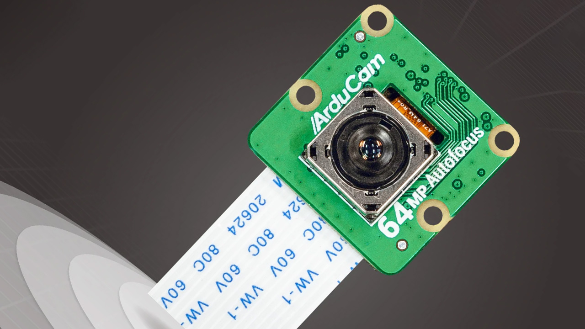

# Arducam-Jetson



* Dockerhub image https://hub.docker.com/r/cognimbus/arducam-jetson
* Supported architectures <b>arm64</b>
* ROS version <b>melodic
</b>

# Short description
* a driver for arducam device for jetson platform that publish ros image topic

# Example usage
```
docker run -it --network=host --privileged -v /dev/video0:/dev/video0 -v /tmp/argus_socket:/tmp/argus_socket cognimbus/arducam-jetson roslaunch local_camera_driver local_camera_driver.launch
```

# Subscribers
This node has no subscribers


# Publishers
ROS topic | type
--- | ---
/camera/image | sensor_msgs/Image
/camera/image/compressed | sensor_msgs/CompressedImage


# Required tf
This node does not require tf


# Provided tf
This node does not provide tf


