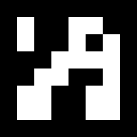

# Aruco-Code-Detection



* Dockerhub image https://hub.docker.com/r/cognimbus/aruco-code-detection
* Supported architectures <b>arm64/amd64</b>
* ROS version <b>noetic
</b>

# Short description
* Detection of square fiducial markers (ArUco Boards)

# Example usage
```
docker run -it --network=host cognimbus/aruco-code-detection roslaunch aruco_detection aruco_detection.launch type:=DICT_ARUCO_ORIGINAL --screen
```

# Subscribers
ROS topic | type
--- | ---
/camera/color/image_raw | sensor_msgs/Image


# Publishers
ROS topic | type
--- | ---
/aruco_detection_img/compressed | sensor_msgs/CompressedImage
/aruco_detected_id | std_msgs/Int32


# Required tf
This node does not require tf


# Provided tf
This node does not provide tf


