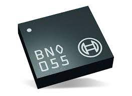

# Bosch-Imu-Driver



* Dockerhub image https://hub.docker.com/r/cognimbus/bosch-imu-driver
* Supported architectures <b>amd64/arm64</b>
* ROS version <b>melodic
</b>

# Short description
* A driver for the sensor IMU Bosch BNO055. It was implemented only the UART communication interface (correct sensor mode should be selected).
License: LGPL
GIT: https://github.com/mdrwiega/bosch_imu_driver: 

# Example usage
```
docker run -it --network=host cognimbus/bosch-imu-driver roslaunch rr_bosch_bno055_imu example.launch --screen
```

# Subscribers
This node has no subscribers


# Publishers
ROS topic | type
--- | ---
/imu/data | sensor_msgs/Imu
/imu/raw | sensor_msgs/Imu
/imu/mag | sensor_msgs/MagneticField


# Required tf
This node does not require tf


# Provided tf
This node does not provide tf


