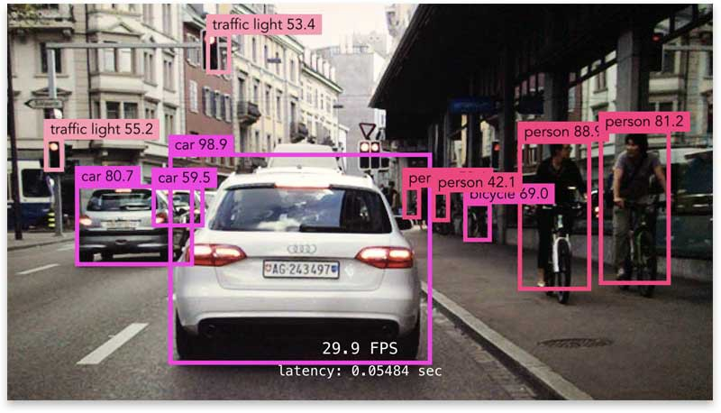

# Caffe-Object-Detection



* Dockerhub image https://hub.docker.com/r/cognimbus/caffe-object-detection
* Supported architectures <b>arm64/amd64</b>
* ROS version <b>noetic
</b>

# Short description
* Mobile SSD Object Detection model in real time using Caffe framework.

# Example usage
```
docker run -it --network=host --privileged cognimbus/caffe-object-detection roslaunch object_detection object_detection.launch --screen
```

# Subscribers
ROS topic | type
--- | ---
/camera/color/image_raw | sensor_msgs/Image


# Publishers
ROS topic | type
--- | ---
/object_detection_img/compressed | sensor_msgs/CompressedImage
/object_detection/objects_msg | object_msgs/ObjectsInBoxes


# Required tf
This node does not require tf


# Provided tf
This node does not provide tf


