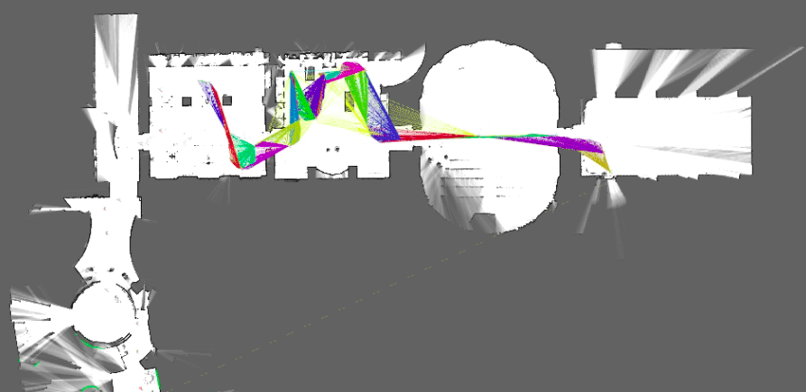

# Cartographer-Slam



* Dockerhub image https://hub.docker.com/r/cognimbus/cartographer-slam
* Supported architectures <b>arm64/amd64</b>
* ROS version <b>noetic
</b>

# Short description
* Cartographer is a system that provides real-time simultaneous localization and mapping (SLAM) in 2D and 3D across multiple platforms and sensor configurations.

# Example usage
```
docker run -it --network=host cognimbus/cartographer-slam roslaunch cartographer_ros my_robot.launch
```

# Subscribers
ROS topic | type
--- | ---
/scan | sensor_msgs/LaserScan


# Publishers
ROS topic | type
--- | ---
/map | nav_msgs/OccupancyGrid
/tracked_pose | geometry_msgs/PoseStamped
/scan_matched_points2 | sensor_msgs/PointCloud2


# Required tf
odom--->base_link


# Provided tf
This node does not provide tf


