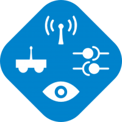
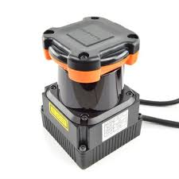

Image | Link
--- | ---
 | [amcl](amcl)
 | [arducam-jetson](arducam-jetson)
 | [autopilot bridge](autopilot bridge)
 | [bboxes-to-3d-markers](bboxes-to-3d-markers)
 | [bosch-imu-driver](bosch-imu-driver)
 | [circle-detection](circle-detection)
 | [client-service-example](client-service-example)
 | [cogniteam-coverage-exploration](cogniteam-coverage-exploration)
 | [cogniteam-image-rotate-filp](cogniteam-image-rotate-filp)
 | [cogniteam-person-follower-depth](cogniteam-person-follower-depth)
 | [cogniteam-person-follower-rgb](cogniteam-person-follower-rgb)
 | [cogniteam-skeleton-gestures](cogniteam-skeleton-gestures)
 | [depth-2-grayscale](depth-2-grayscale)
 | [depth-2-pcloud](depth-2-pcloud)
 | [generic-webcam](generic-webcam)
 | [gmapping](gmapping)
 | [hamster-driver](hamster-driver)
 | [hamster-driver](hamster-driver)
 | [hamster-v8-environment](hamster-v8-environment)
 | [hector-mapping](hector-mapping)
 | [hector-mapping](hector-mapping)
 | [hokuyo](hokuyo)
 | [image-republisher](image-republisher)
 | [jetson-isaac-skeleton](jetson-isaac-skeleton)
 | [kobuki-driver](kobuki-driver)
 | [lsd-lidar-c16](lsd-lidar-c16)
 | [lynx](lynx)
 | [lynx](lynx)
 | [lynx](lynx)
 | [map-server](map-server)
 | [mir-driver](mir-driver)
 | [move-base-navigation](move-base-navigation)
 | [novatel-gps](novatel-gps)
 | [omron-ld60-driver](omron-ld60-driver)
 | [orb2-slam](orb2-slam)
 | [ouster-driver](ouster-driver)
 | [razor-imu](razor-imu)
 | [realsense-camera](realsense-camera)
 | [realsense-camera](realsense-camera)
 | [realsense-camera](realsense-camera)
 | [realsense-t265](realsense-t265)
 | [ros-deep-learning-jetson-inference](ros-deep-learning-jetson-inference)
 | [ros_audio](ros_audio)
 | [ros_audio](ros_audio)
 | [rover-driver](rover-driver)
 | [rtsp-camera](rtsp-camera)
 | [server-service-example](server-service-example)
 | [theora-encoder](theora-encoder)
 | [ubiquity-driver](ubiquity-driver)
 | [velodyne-vlp-16](velodyne-vlp-16)
 | [waypoints-navigation](waypoints-navigation)
 | [ydlidar-tg30](ydlidar-tg30)
 | [yocs-velocity-smoother](yocs-velocity-smoother)
 | [zed-camera-jetson-xavier](zed-camera-jetson-xavier)
