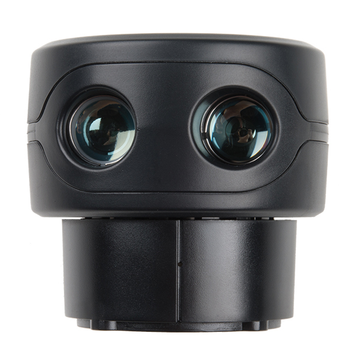

# Sweep-Lidar



* Dockerhub image https://hub.docker.com/r/cognimbus/sweep_lidar
* Supported architectures <b>amd64</b>
* ROS version <b>kinetic-ros-core
</b>

# Short description
* The Sweep 360-degree rotating LIDAR has a range of 40 meters. This is the Scanse Sweep ROS driver and node.
License: MIT

# Example usage
```
docker run -it --network=host cognimbus/sweep_lidar 
```

# Subscribers
This node has no subscribers


# Publishers
ROS topic | type
--- | ---
/scan | sensor_msgs/LaserScan


# Required tf
This node does not require tf


# Provided tf
This node does not provide tf


