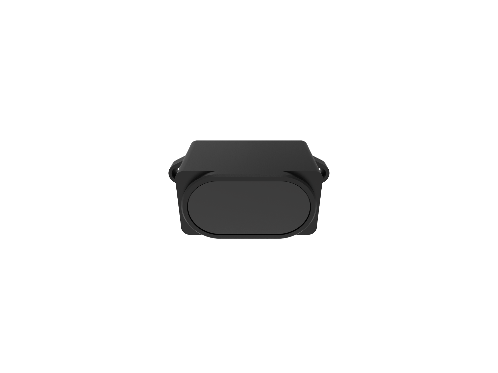

# Ydlidar-Tmini-Pro


* Dockerhub image https://hub.docker.com/r/cognimbus/ros-ydlidar-driver
* Supported architectures <b>arm64/amd64/unknown/unknown</b>
* ROS version <b>noetic
</b>

# Short description
* 

# Example usage
```
docker run -it --network=host --privileged cognimbus/ros-ydlidar-driver:noetic roslaunch ydlidar_ros_driver Tmini.launch port:=/dev/ydlidar frame_id:=laser baudrate:=230400 lidar_type:=1 device_type:=0 sample_rate:=9 abnormal_check_count:=4 fixed_resolution:=true reversion:=true inverted:=true auto_reconnect:=true isSingleChannel:=false intensity:=false support_motor_dtr:=false angle_min:=-180 angle_max:=180 range_min:=0.1 range_max:=16.0 frequency:=10.0 invalid_range_is_inf:=false point_cloud_preservative:=false
```

# Subscribers
This node has no subscribers


# Publishers
ROS topic | type
--- | ---
/scan | sensor_msgs/LaserScan


# Required tf
This node does not require tf


# Provided tf
This node does not provide tf


# Ydlidar-Sdm15



* Dockerhub image https://hub.docker.com/r/cognimbus/ros-ydlidar-driver
* Supported architectures <b>arm64/amd64/unknown/unknown</b>
* ROS version <b>noetic
</b>

# Short description
* 

# Example usage
```
docker run -it --network=host --privileged cognimbus/ros-ydlidar-driver:noetic roslaunch ydlidar_ros_driver SDM15.launch port:=/dev/ydlidar frame_id:=laser baudrate:=230400 lidar_type:=1 device_type:=0 sample_rate:=9 abnormal_check_count:=4 fixed_resolution:=true reversion:=true inverted:=true auto_reconnect:=true isSingleChannel:=false intensity:=false support_motor_dtr:=false angle_min:=-180 angle_max:=180 range_min:=0.1 range_max:=16.0 frequency:=10.0 invalid_range_is_inf:=false point_cloud_preservative:=false
```

# Subscribers
This node has no subscribers


# Publishers
ROS topic | type
--- | ---
/scan | sensor_msgs/LaserScan


# Required tf
This node does not require tf


# Provided tf
This node does not provide tf


