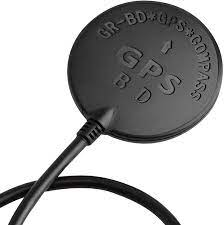

# Deegoo-Fpv-Gps



* Dockerhub image https://hub.docker.com/r/cognimbus/deegoo-fpv-gps
* Supported architectures <b>arm64/amd64</b>
* ROS version <b>noetic
</b>

# Short description
* deegoo-fpv-gps driver
License: BSD

# Example usage
```
docker run -it --network=host cognimbus/deegoo-fpv-gps roslaunch nmea_navsat_driver nmea_serial_driver.launch baud:=9600 frame_id:=gps --screen
```

# Subscribers
This node has no subscribers


# Publishers
ROS topic | type
--- | ---
/fix | sensor_msgs/NavSatFix
/heading | geometry_msgs/QuaternionStamped
/vel | geometry_msgs/TwistStamped


# Required tf
This node does not require tf


# Provided tf
This node does not provide tf


