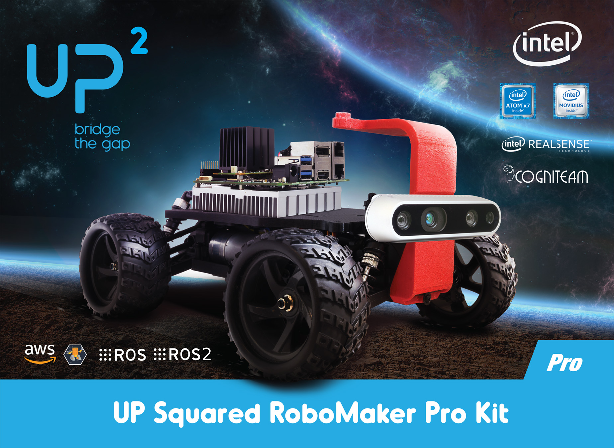

# Prokit-Driver



* Dockerhub image https://hub.docker.com/r/cognimbus/hamster-driver
* Supported architectures <b>arm64/amd64</b>
* ROS version <b>melodic
</b>

# Short description
* AAEON Prokit driver 
git: https://github.com/cognimbus/nimbus.library/tree/master/Library/Components/hamster-driver/prokit-driver
License: BSD

# Example usage
```
docker run -it --network=host --privileged cognimbus/hamster-driver roslaunch hamster_driver hamster_driver.launch serial_port:=/dev/ttyS5 robot_id:= odom_frame:=odom base_frame:=base_link max_speed:=1.2 steer_offset:=0 mag_offset_x:=0 mag_offset_y:=0 mag_offset_z:=0 gyro_offset_x:=0 gyro_offset_y:=0 gyro_offset_z:=0 enable_gps:=true enable_detection:=false enable_realsense:=false
```

# Subscribers
ROS topic | type
--- | ---
/ackermann_cmd | ackermann_msgs/AckermannDriveStamped
/twist_cmd | geometry_msgs/Twist
/camera/gyro/sample | sensor_msgs/Imu
/camera/accel/sample | sensor_msgs/Imu


# Publishers
ROS topic | type
--- | ---
/odom | nav_msgs/Odometry
/battery | std_msgs/Float32


# Required tf
This node does not require tf


# Provided tf
This node does not provide tf


# Hamster-Driver


* Dockerhub image https://hub.docker.com/r/cognimbus/hamster-driver
* Supported architectures <b>arm64/amd64</b>
* ROS version <b>melodic
</b>

# Short description
* Cogniteam Hamster V7 Nvidia Xavier NX driver
git: https://github.com/cognimbus/nimbus.library/tree/master/Library/Components/hamster-driver
License: BSD

# Example usage
```
docker run -it --network=host --privileged cognimbus/hamster-driver roslaunch hamster_driver hamster_driver.launch serial_port:=/dev/ttyAMA0 robot_id:= odom_frame:=odom base_frame:=base_link max_speed:=1.2 steer_offset:=0 mag_offset_x:=0 mag_offset_y:=0 mag_offset_z:=0 gyro_offset_x:=0 gyro_offset_y:=0 gyro_offset_z:=0 enable_gps:=true enable_detection:=false enable_realsense:=false
```

# Subscribers
ROS topic | type
--- | ---
/ackermann_cmd | ackermann_msgs/AckermannDriveStamped
/twist_cmd | geometry_msgs/Twist
/camera/gyro/sample | sensor_msgs/Imu
/camera/accel/sample | sensor_msgs/Imu


# Publishers
ROS topic | type
--- | ---
/odom | nav_msgs/Odometry
/battery | std_msgs/Float32


# Required tf
This node does not require tf


# Provided tf
This node does not provide tf


