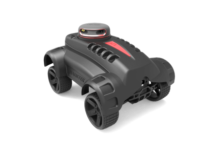

# Hamster-Wandering



* Dockerhub image https://hub.docker.com/r/cognimbus/hamster-wandering
* Supported architectures <b>arm64</b>
* ROS version <b>noetic
</b>

# Short description
* ros node that get the odometry from hamster robot, subscribe to the laser-scan msg from the lidar and send ackerman msgs to the robot while avoides obstacles.
License: BSD

# Example usage
```
docker run -it --network=host --privileged cognimbus/hamster-wandering roslaunch hamster_wandering wandering.launch
```

# Subscribers
ROS topic | type
--- | ---
scan | sensor_msgs/LaserScan


# Publishers
ROS topic | type
--- | ---
/ackermann_cmd | ackermann_msgs/AckermannDriveStamped
/wander/costmap | nav_msgs/OccupancyGrid
/wander/path | nav_msgs/Path
/wander/path_best | nav_msgs/Path


# Required tf
odom--->base_link


# Provided tf
This node does not provide tf


