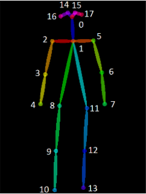

# Jetson-Isaac-Skeleton



* Dockerhub image https://hub.docker.com/r/cognimbus/jetson-isaac-skeleton-ros
* Supported architectures <b>arm64</b>
* ROS version <b>r32.3.1
</b>

# Short description
* A component that receives an image and returns an array of human skeletons using a isaac library.
License: LGPL
GIT: http://wiki.ros.org/amcl
Source: git: https://github.com/cognimbus/nimbus.library/tree/master/Library/Components/

# Example usage
```
docker run -it --network=host cognimbus/jetson-isaac-skeleton-ros 
```

# Subscribers
ROS topic | type
--- | ---
/webcam/image_raw | sensor_msgs/Image


# Publishers
ROS topic | type
--- | ---
/skeletons_text | std_msgs/String


# Required tf
This node does not require tf


# Provided tf
This node does not provide tf


