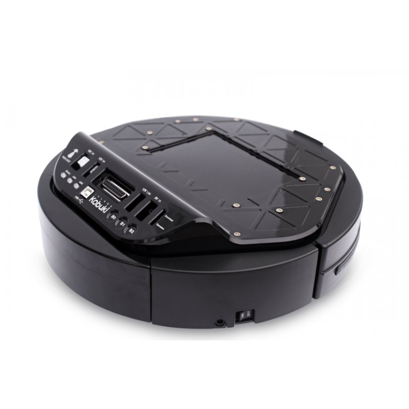

# Yujin-Kobuki-Driver



* Dockerhub image https://hub.docker.com/r/cognimbus/kobuki_driver
* Supported architectures <b>arm64/amd64</b>
* ROS version <b>melodic
</b>

# Short description
* Yujin Kobuki robot driver
git: https://github.com/cognimbus/nimbus.library/tree/master/Library/Components/kobuki-driver
License: BSD

# Example usage
```
docker run -it --network=host cognimbus/kobuki_driver roslaunch kobuki_launch kobuki.launch base:=kobuki base_frame:=base_link stacks:=hexagons 3d_sensor:=r200 serialport:=/dev/ttyUSB0 kobuki_publish_tf:=true undocking_duration_seconds:=3
```

# Subscribers
ROS topic | type
--- | ---
/start_stop_auto_docking | std_msgs/Bool
/undock_from_charger | std_msgs/Bool
/mobile_base/commands/velocity | geometry_msgs/Twist
/mobile_base/commands/digital_output | kobuki_msgs/DigitalOutput


# Publishers
ROS topic | type
--- | ---
/odom | nav_msgs/Odometry
/mobile_base/sensors/imu_data | sensor_msgs/Imu
/mobile_base/events/cliff | kobuki_msgs/CliffEvent
/mobile_base/events/bumper | kobuki_msgs/BumperEvent
/mobile_base/sensors/bumper_pointcloud | sensor_msgs/PointCloud2
/battery_voltage | std_msgs/Int32
/docking_feedback_string | std_msgs/String
/is_charging_in_docking_station | std_msgs/Bool


# Required tf
This node does not require tf


# Provided tf
This node does not provide tf


