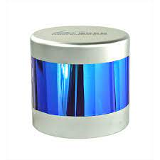

# Lsd-Lidar-C16



* Dockerhub image https://hub.docker.com/r/cognimbus/lsd-lidar-c16
* Supported architectures <b>amd64/arm64</b>
* ROS version <b>melodic
</b>

# Short description
* lsd-lidar-c16 driver
License: BSD

# Example usage
```
docker run -it --network=host cognimbus/lsd-lidar-c16 roslaunch lslidar_c16_decoder lslidar_c16.launch frame_id:=laser lidar_ip:=192.168.1.200 device_port:=2368 --screen
```

# Subscribers
This node has no subscribers


# Publishers
ROS topic | type
--- | ---
/scan_topic | sensor_msgs/LaserScan
/lslidar_point_cloud | sensor_msgs/PointCloud2


# Required tf
This node does not require tf


# Provided tf
This node does not provide tf


