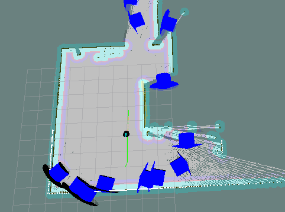

# M-Exploration



* Dockerhub image https://hub.docker.com/r/cognimbus/m_exploration
* Supported architectures <b>arm64/amd64</b>
* ROS version <b>
</b>

# Short description
* Greedy frontier-based exploration algorithm
git: https://github.com/cognimbus/nimbus.library/tree/master/Library/Components/m-exploration
License: BSD

# Example usage
```
docker run -it --network=host cognimbus/m_exploration roslaunch explore_lite explore.launch robot_base_frame:=base_link costmap_topic:=map costmap_updates_topic:=map_updates progress_timeout:=30 potential_scale:=3 orientation_scale:=0 gain_scale:=1 transform_tolerance:=0.3 min_frontier_size:=0.75 visualize:=true planner_frequency:=0.1 planner_frequency:=0.1 --screen
```

# Subscribers
ROS topic | type
--- | ---
/map_updates | map_msgs/OccupancyGridUpdate
/map | nav_msgs/OccupancyGrid
/move_base/feedback | move_base_msgs/MoveBaseActionFeedback
/move_base/result | move_base_msgs/MoveBaseActionResult
/move_base/status | actionlib_msgs/GoalStatusArray


# Publishers
ROS topic | type
--- | ---
/move_base/cancel | actionlib_msgs/GoalID
/move_base/goal | move_base_msgs/MoveBaseActionGoal
/finished_exploration | std_msgs/Bool
/explore/frontiers | visualization_msgs/MarkerArray


# Required tf
map--->base_link
odom--->base_link


# Provided tf
This node does not provide tf


