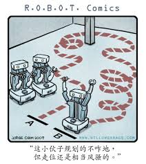

# Move-Base-Navigation



* Dockerhub image https://hub.docker.com/r/cognimbus/move-base
* Supported architectures <b>arm64/amd64</b>
* ROS version <b>FROM cognimbus/kobuki_driver
</b>

# Short description
* The move_base package provides an implementation of an action (see the actionlib package) that, given a goal in the world, will attempt to reach it with a mobile base. The move_base node links together a global and local planner to accomplish its global navigation task. It supports any global planner adhering to the nav_core::BaseGlobalPlanner interface specified in the nav_core package and any local planner adhering to the nav_core::BaseLocalPlanner interface specified in the nav_core package. The move_base node also maintains two costmaps, one for the global planner, and one for a local planner (see the costmap_2d package) that are used to accomplish navigation tasks.
License: BSD
GIT:https://github.com/ros-planning/navigation.git

# Example usage
```
docker run -it --network=host cognimbus/move-base:latest roslaunch turtlebot_navigation move_base.launch.xml global_frame_id:=map base_frame_id:=base_link general_odom_topic:=odom laser_topic:=scan scan_min_obstacle_height:=0.2 scan_max_obstacle_height:=0.5 d435_cam1_min_obstacle_height:=0.15 d435_cam1_max_obstacle_height:=1 bump_min_obstacle_height:=0 bump_max_obstacle_height:=0 max_obstacle_height:=1 local_costmap_transform_tolerance:=0.5 global_costmap_transform_tolerance:=0.5 scan_observation_persistence:=0 d435_cam1_observation_persistence:=0 general_max_vel_x:=0.8 general_max_vel_y:=0 general_min_vel_x:=0.3 dwa_min_vel_y:=0 costmap_obstacle_range:=2.5 global_origin_x:=0 global_origin_y:=0 global_origin_z:=0 global_map_width:=20 global_map_height:=20 local_map_width:=6 local_map_height:=6 robot_radius:=0.2 track_unknown_space:=false local_inflation_radius:=0.1 enable_static_layer:=true dwa_planner_activated:=true recovery_behavior_enabled:=true dwa_max_trans_vel:=0.5 dwa_min_trans_vel:=0.1 dwa_trans_stopped_vel:=0.1 dwa_max_vel_theta:=4 dwa_min_vel_theta:=0.5 dwa_max_rot_vel:=4 dwa_min_rot_vel:=0.5 dwa_rot_stopped_vel:=0.5 dwa_acc_lim_x:=1 dwa_acc_lim_theta:=3 dwa_acc_lim_y:=0 general_yaw_goal_tolerance:=0.3 general_xy_goal_tolerance:=0.15 dwa_sim_time:=2 dwa_vx_samples:=10 dwa_vy_samples:=1 dwa_vtheta_samples:=20 dwa_path_distance_bias:=128 dwa_goal_distance_bias:=24 dwa_occdist_scale:=0.3 dwa_forward_point_distance:=0.325 dwa_stop_time_buffer:=0.2 dwa_scaling_speed:=0.25 dwa_max_scaling_factor:=0.2 dwa_oscillation_reset_dist:=0.05 dwa_publish_traj_pc:=true dwa_publish_cost_grid_pc:=true teb_autosize:=true teb_dt_ref:=0.3 teb_dt_hysteresis:=0.1 teb_global_plan_overwrite_orientation:=true teb_max_global_plan_lookahead_dist:=2 teb_feasibility_check_no_poses:=2 teb_max_vel_x_backwards:=0.2 teb_max_vel_theta:=1.5 teb_acc_lim_x:=0.2 teb_acc_lim_theta:=0.6 teb_min_turning_radius:=0.4 teb_wheelbase:=0.16 teb_cmd_angle_instead_rotvel:=true teb_footprint_model_type:=point teb_free_goal_vel:=false teb_min_obstacle_dist:=0.2 teb_include_costmap_obstacles:=true teb_costmap_obstacles_behind_robot_dist:=1 teb_obstacle_poses_affected:=15 teb_costmap_converter_plugin:= teb_costmap_converter_spin_thread:=true teb_costmap_converter_rate:=5 teb_no_inner_iterations:=3 teb_no_outer_iterations:=2 teb_optimization_activate:=true teb_optimization_verbose:=false teb_penalty_epsilon:=0.1 teb_weight_max_vel_x:=2 teb_weight_max_vel_theta:=1 teb_weight_acc_lim_x:=1 teb_weight_acc_lim_theta:=1 teb_weight_kinematics_nh:=1000 teb_weight_kinematics_forward_drive:=1 teb_weight_kinematics_turning_radius:=1 teb_weight_optimaltime:=10 teb_weight_obstacle:=20 teb_weight_dynamic_obstacle:=10 teb_enable_homotopy_class_planning:=false teb_enable_multithreading:=true teb_simple_exploration:=false teb_max_number_classes:=4 teb_selection_cost_hysteresis:=1 teb_selection_obst_cost_scale:=1 teb_selection_alternative_time_cost:=false teb_roadmap_graph_no_samples:=15 teb_roadmap_graph_area_width:=5 teb_h_signature_prescaler:=0.5 teb_h_signature_threshold:=0.1 teb_obstacle_keypoint_offset:=0.1 teb_obstacle_heading_threshold:=0.45 teb_visualize_hc_graph:=false
```

# Subscribers
ROS topic | type
--- | ---
/move_base_simple/goal | geometry_msgs/PoseStamped
/move_base/goal | move_base_msgs/MoveBaseActionGoal
/move_base/cancel | actionlib_msgs/GoalID
/map | nav_msgs/OccupancyGrid
/cam1/depth/color/points | sensor_msgs/PointCloud2
scan | sensor_msgs/LaserScan
odom | nav_msgs/Odometry
/mobile_base/sensors/bumper_pointcloud | sensor_msgs/PointCloud2


# Publishers
ROS topic | type
--- | ---
/navigation_velocity_smoother/raw_cmd_vel | geometry_msgs/Twist
/move_base/local_costmap/costmap | nav_msgs/OccupancyGrid
/move_base/global_costmap/costmap_updates | map_msgs/OccupancyGridUpdate
/move_base/global_costmap/costmap | nav_msgs/OccupancyGrid
/move_base/DWAPlannerROS/global_plan | nav_msgs/Path
/move_base/NavfnROS/plan | nav_msgs/Path
/move_base/status | actionlib_msgs/GoalStatusArray
/move_base/feedback | move_base_msgs/MoveBaseActionFeedback
/move_base/result | move_base_msgs/MoveBaseActionResult


# Required tf
odom--->base_link
map--->odom
base_link--->camera_depth_optical_frame


# Provided tf
This node does not provide tf


