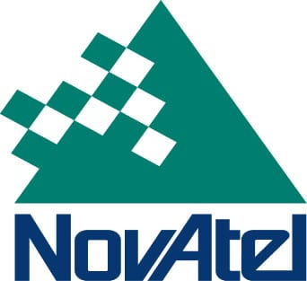

# Novatel-Gps



* Dockerhub image https://hub.docker.com/r/cognimbus/novatel-gps
* Supported architectures <b>arm64/amd64</b>
* ROS version <b>melodic
</b>

# Short description
* Novatel GPS driver.
License: BSD.
GIT:https://github.com/swri-robotics/novatel_gps_driver.git

# Example usage
```
docker run -it --network=host cognimbus/novatel-gps roslaunch novatel_oem7_driver oem7_net.launch oem7_ip_addr:=192.168.74.10 oem7_port:=6002 oem7_if:=Oem7ReceiverUdp
```

# Subscribers
This node has no subscribers


# Publishers
ROS topic | type
--- | ---
/novatel/oem7/odom | nav_msgs/Odometry
/gps/imu | sensor_msgs/Imu
/gps/fix | sensor_msgs/NavSatFix


# Required tf
This node does not require tf


# Provided tf
This node does not provide tf


