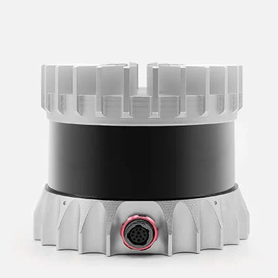

# Ouster-Driver



* Dockerhub image https://hub.docker.com/r/cognimbus/ros1-ouster-driver
* Supported architectures <b>arm64/amd64</b>
* ROS version <b>ARG ROS_DISTRO=melodic
</b>

# Short description
* ouster-lidar driver
License: BSD

# Example usage
```
docker run -it --network=host cognimbus/ros1-ouster-driver sensor_hostname:=192.168.1.22
```

# Subscribers
This node has no subscribers


# Publishers
ROS topic | type
--- | ---
/ouster/nearir_image | sensor_msgs/Image
/ouster/range_image | sensor_msgs/Image
/ouster/signal_image | sensor_msgs/Image
/ouster/reflec_image | sensor_msgs/Image
/ouster/range_image2 | sensor_msgs/Image
/ouster/signal_image2 | sensor_msgs/Image
/ouster/imu | sensor_msgs/Imu
/ouster/points | sensor_msgs/PointCloud2
/ouster/points2 | sensor_msgs/PointCloud2


# Required tf
This node does not require tf


# Provided tf
This node does not provide tf


