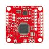

# Razor-Imu



* Dockerhub image https://hub.docker.com/r/cognimbus/razor-imu
* Supported architectures <b>amd64/arm64</b>
* ROS version <b>melodic
</b>

# Short description
* razor-imu.
Source: https://github.com/mitll-ros-pkg/razor_imu_m0_driver
License: BSD

# Example usage
```
docker run -it --network=host cognimbus/razor-imu roslaunch razor_imu_m0_driver driver_node.launch --screen
```

# Subscribers
This node has no subscribers


# Publishers
ROS topic | type
--- | ---
/imu/data | sensor_msgs/Imu
/imu/data_raw | sensor_msgs/Imu
/imu/mag | sensor_msgs/MagneticField


# Required tf
This node does not require tf


# Provided tf
This node does not provide tf


