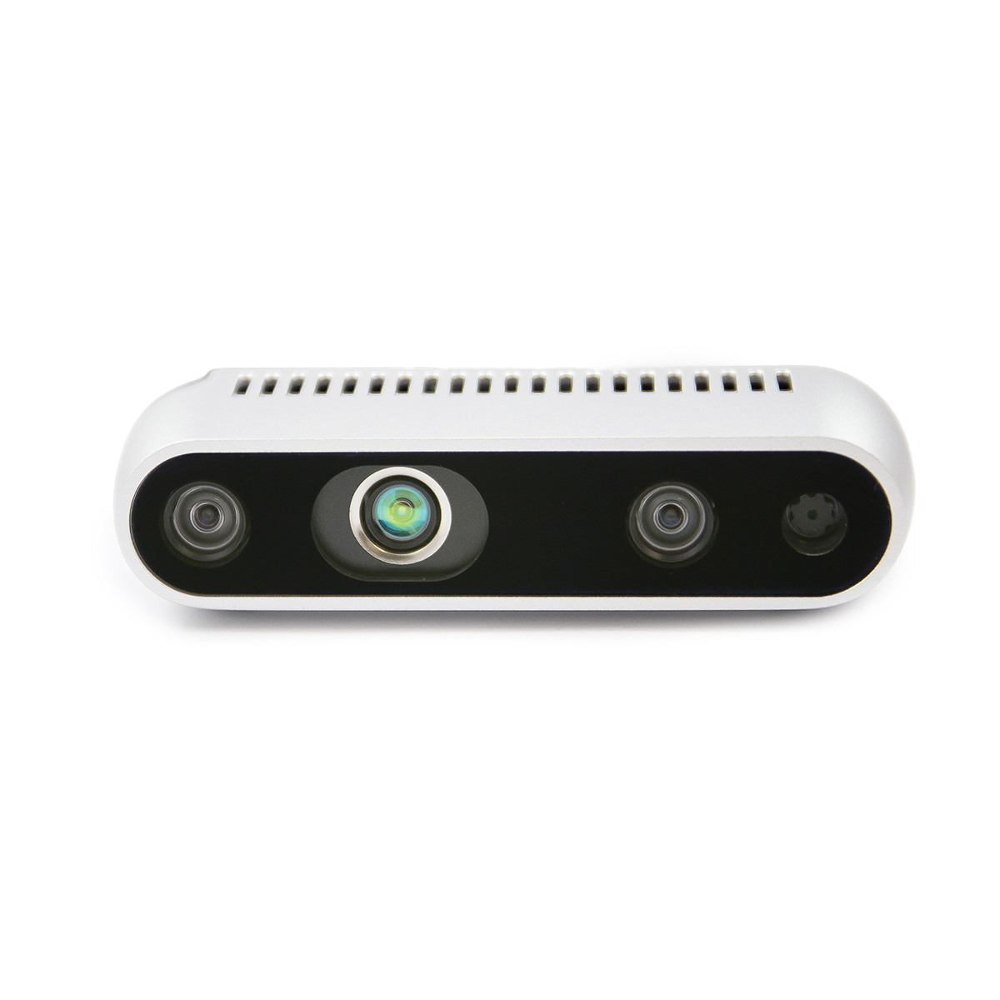
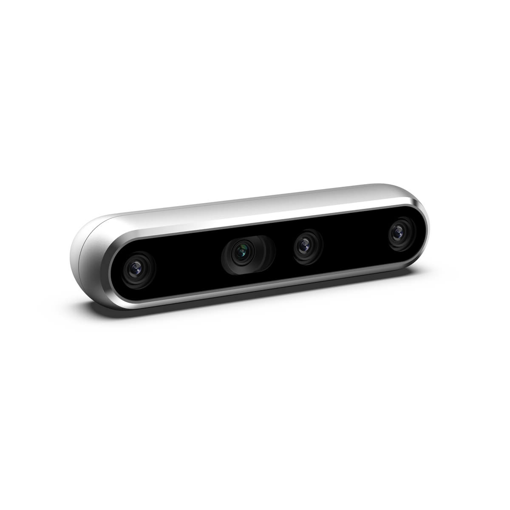

# Realsense-Camera-D435



* Dockerhub image https://hub.docker.com/r/cognimbus/realsense2
* Supported architectures <b>arm64/amd64</b>
* ROS version <b>melodic-ros-core
</b>

# Short description
* Intel Realsense D435 ROS driver
License: Apache 2.0

# Example usage
```
docker run -it --network=host --privileged cognimbus/realsense2 roslaunch rs_camera_with_jpeg_level.launch enable_gyro:=true enable_accel:=true serial_no:= enable_fisheye:=false enable_infra:=false enable_infra1:=false enable_infra2:=false fisheye_fps:=30 depth_fps:=30 infra_fps:=30 color_fps:=15 color_width:=640 color_height:=480 gyro_fps:=400 accel_fps:=250 enable_pointcloud:=false publish_tf:=true tf_publish_rate:=10 base_frame_id:=camera emitter_enabled:=1 required:=true
```

# Subscribers
This node has no subscribers


# Publishers
ROS topic | type
--- | ---
/camera/color/image_raw | sensor_msgs/Image
/camera/color/camera_info | sensor_msgs/CameraInfo
/camera/infra1/image_rect_raw | sensor_msgs/Image
/camera/infra2/image_rect_raw | sensor_msgs/Image
/camera/infra1/camera_info | sensor_msgs/CameraInfo
/camera/infra2/camera_info | sensor_msgs/CameraInfo
/camera/color/image_raw/compressed | sensor_msgs/CompressedImage
/camera/depth/camera_info/ | sensor_msgs/CameraInfo
/camera/depth/image_rect_raw | sensor_msgs/Image
/camera/gyro/sample | sensor_msgs/Imu
/camera/accel/sample | sensor_msgs/Imu
/camera/depth/color/points | sensor_msgs/PointCloud2


# Required tf
This node does not require tf


# Provided tf
base_link--->camera_depth_optical_frame


# Realsense-Camera-D455



* Dockerhub image https://hub.docker.com/r/cognimbus/realsense2
* Supported architectures <b>arm64/amd64</b>
* ROS version <b>melodic-ros-core
</b>

# Short description
* Intel Realsense D455 ROS driver
License: Apache 2.0

# Example usage
```
docker run -it --network=host --privileged cognimbus/realsense2 roslaunch rs_camera_with_jpeg_level.launch enable_gyro:=true enable_accel:=true serial_no:= enable_fisheye:=false enable_infra:=false enable_infra1:=false enable_infra2:=false fisheye_fps:=30 depth_fps:=30 infra_fps:=30 color_fps:=30 gyro_fps:=400 accel_fps:=250 enable_pointcloud:=false publish_tf:=true usb_port_id:= frame_id:=camera required:=true
```

# Subscribers
This node has no subscribers


# Publishers
ROS topic | type
--- | ---
/camera/color/image_raw | sensor_msgs/Image
/camera/color/image_raw/compressed | sensor_msgs/CompressedImage
/camera/color/camera_info | sensor_msgs/CameraInfo
/camera/depth/image_rect_raw | sensor_msgs/Image
/camera/gyro/sample | sensor_msgs/Imu
/camera/accel/sample | sensor_msgs/Imu


# Required tf
This node does not require tf


# Provided tf
This node does not provide tf


# Realsense-Camera-L515


* Dockerhub image https://hub.docker.com/r/cognimbus/realsense2
* Supported architectures <b>arm64/amd64</b>
* ROS version <b>melodic-ros-core
</b>

# Short description
* Intel Realsense L515 ROS driver
License: Apache 2.0

# Example usage
```
docker run -it --network=host --privileged cognimbus/realsense2 roslaunch rs_camera_with_jpeg_level.launch enable_gyro:=true enable_accel:=true serial_no:= enable_fisheye:=false enable_infra:=false enable_infra1:=false enable_infra2:=false fisheye_fps:=30 depth_fps:=30 infra_fps:=30 color_fps:=15 color_width:=640 color_height:=480 gyro_fps:=400 accel_fps:=250 enable_pointcloud:=false publish_tf:=true tf_publish_rate:=10 base_frame_id:=camera emitter_enabled:=1 required:=true
```

# Subscribers
This node has no subscribers


# Publishers
ROS topic | type
--- | ---
/camera/color/image_raw | sensor_msgs/Image
/camera/color/camera_info | sensor_msgs/CameraInfo
/camera/infra1/image_rect_raw | sensor_msgs/Image
/camera/infra2/image_rect_raw | sensor_msgs/Image
/camera/infra1/camera_info | sensor_msgs/CameraInfo
/camera/infra2/camera_info | sensor_msgs/CameraInfo
/camera/color/image_raw/compressed | sensor_msgs/CompressedImage
/camera/depth/camera_info/ | sensor_msgs/CameraInfo
/camera/depth/image_rect_raw | sensor_msgs/Image
/camera/gyro/sample | sensor_msgs/Imu
/camera/accel/sample | sensor_msgs/Imu
/camera/depth/color/points | sensor_msgs/PointCloud2


# Required tf
This node does not require tf


# Provided tf
base_link--->camera_depth_optical_frame


