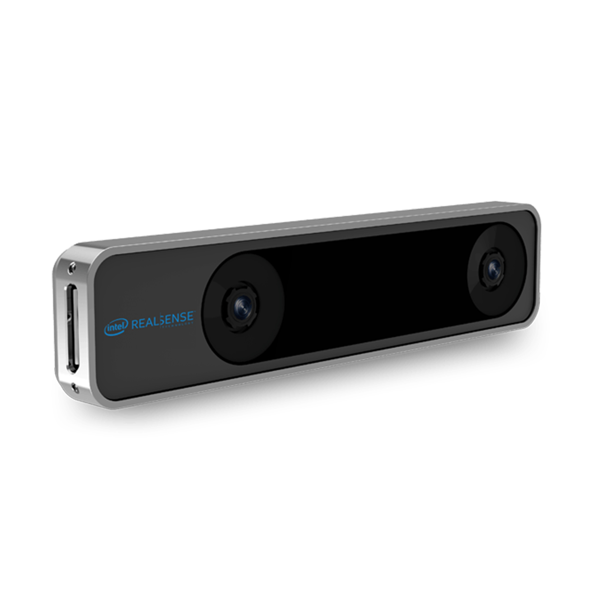

# Realsense-T265



* Dockerhub image https://hub.docker.com/r/cognimbus/realsenset265
* Supported architectures <b>amd64/arm64</b>
* ROS version <b>melodic-ros-core
</b>

# Short description
* Intel Realsense T265 ROS driver
License: Apache 2.0

# Example usage
```
docker run -it --network=host --privileged cognimbus/realsenset265 roslaunch realsense2_camera cogniteam_rs_t265.launch enable_fisheye2:=true enable_fisheye1:=true device_type:=t265 camera:=camera fisheye_width:=-1 fisheye_height:=-1 fisheye_fps:=-1 gyro_fps:=-1 accel_fps:=-1 enable_gyro:=true enable_accel:=true enable_pose:=true enable_sync:=false initial_reset:=false publish_odom_tf:=true unite_imu_method:= linear_accel_cov:=0.01 required:=true
```

# Subscribers
This node has no subscribers


# Publishers
ROS topic | type
--- | ---
/camera/odom/sample | nav_msgs/Odometry
/camera/gyro/sample | sensor_msgs/Imu
/camera/accel/sample | sensor_msgs/Imu


# Required tf
This node does not require tf


# Provided tf
This node does not provide tf


