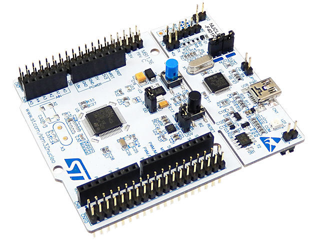

# Ros-Serial-St-Python



* Dockerhub image https://hub.docker.com/r/cognimbus/rosserial_st_python
* Supported architectures <b>arm64/amd64</b>
* ROS version <b>noetic
</b>

# Short description
* Example of using ros-serial with Nimbus 
License:  BSD

# Example usage
```
docker run -it --network=host cognimbus/rosserial_st_python roslaunch ros_serial_python.launch --screen
```

# Subscribers
ROS topic | type
--- | ---
/output/position | geometry_msgs/Point


# Publishers
ROS topic | type
--- | ---
/data_to_algo | geometry_msgs/Point
/robotPosition | geometry_msgs/Pose2D
/gap_sensor_data | geometry_msgs/Twist
/debug_data | geometry_msgs/Twist


# Required tf
This node does not require tf


# Provided tf
This node does not provide tf


