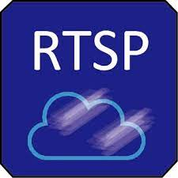

# Rtsp-Camera



* Dockerhub image https://hub.docker.com/r/cognimbus/rtsp-camera
* Supported architectures <b>arm64/amd64</b>
* ROS version <b>melodic
</b>

# Short description
* RTSP camera driver
License: BSD

# Example usage
```
docker run -it --network=host cognimbus/rtsp-camera roslaunch video_stream_opencv camera.launch video_stream_provider:=rtsp://admin@192.168.217.20:554/av0_0 camera_name:=camera camera_frame:=network_camera
```

# Subscribers
This node has no subscribers


# Publishers
ROS topic | type
--- | ---
/camera/image_raw | sensor_msgs/Image


# Required tf
This node does not require tf


# Provided tf
This node does not provide tf


