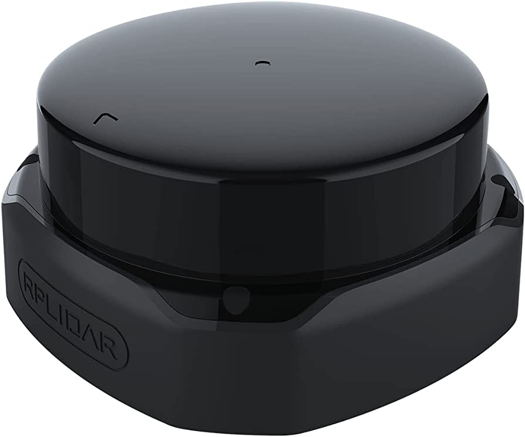

# Rplidar-A1


* Dockerhub image https://hub.docker.com/r/cognimbus/rplidar-a1-ros
* Supported architectures <b>arm64</b>
* ROS version <b>noetic
</b>

# Short description
* Slamtec RPLidar A1 driver 
License: BSD

# Example usage
```
docker run -it --network=host cognimbus/rplidar-a1-ros:latest roslaunch rplidar_ros rplidar.launch frame_id:=laser
```

# Subscribers
This node has no subscribers


# Publishers
ROS topic | type
--- | ---
/scan | sensor_msgs/LaserScan


# Required tf
This node does not require tf


# Provided tf
This node does not provide tf


# Rplidar-A3


* Dockerhub image https://hub.docker.com/r/cognimbus/rplidar-ros
* Supported architectures <b>arm64/amd64</b>
* ROS version <b>noetic
</b>

# Short description
* Slamtec RPLidar A3 driver
License: BSD

# Example usage
```
docker run -it --network=host cognimbus/rplidar-ros:latest roslaunch rplidar_ros rplidar_a3.launch frame_id:=laser
```

# Subscribers
This node has no subscribers


# Publishers
ROS topic | type
--- | ---
/scan | sensor_msgs/LaserScan


# Required tf
This node does not require tf


# Provided tf
This node does not provide tf


# Rplidar-A2


* Dockerhub image https://hub.docker.com/r/cognimbus/rplidar-ros
* Supported architectures <b>arm64/amd64</b>
* ROS version <b>noetic
</b>

# Short description
* Slamtec RPLidar A2 driver
License: BSD

# Example usage
```
docker run -it --network=host cognimbus/rplidar-ros:latest roslaunch rplidar_ros rplidar.launch frame_id:=laser
```

# Subscribers
This node has no subscribers


# Publishers
ROS topic | type
--- | ---
/scan | sensor_msgs/LaserScan


# Required tf
This node does not require tf


# Provided tf
This node does not provide tf


# Rplidar-S1


* Dockerhub image https://hub.docker.com/r/cognimbus/rplidar-ros
* Supported architectures <b>arm64/amd64</b>
* ROS version <b>noetic
</b>

# Short description
* Slamtec RPLidar S1 driver
License: BSD

# Example usage
```
docker run -it --network=host cognimbus/rplidar-ros:latest roslaunch rplidar_ros rplidar_s1.launch frame_id:=laser
```

# Subscribers
This node has no subscribers


# Publishers
ROS topic | type
--- | ---
/scan | sensor_msgs/LaserScan


# Required tf
This node does not require tf


# Provided tf
This node does not provide tf


# Rplidar-S2



* Dockerhub image https://hub.docker.com/r/cognimbus/rplidar-ros
* Supported architectures <b>arm64/amd64</b>
* ROS version <b>noetic
</b>

# Short description
* Slamtec RPLidar S1 driver
License: BSD

# Example usage
```
docker run -it --network=host cognimbus/rplidar-ros:latest roslaunch rplidar_ros rplidar_s2.launch frame_id:=laser
```

# Subscribers
This node has no subscribers


# Publishers
ROS topic | type
--- | ---
/scan | sensor_msgs/LaserScan


# Required tf
This node does not require tf


# Provided tf
This node does not provide tf


