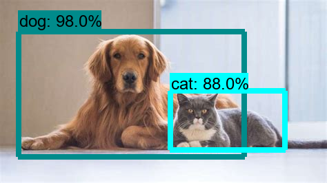

# Tflite-Object-Detection



* Dockerhub image https://hub.docker.com/r/cognimbus/tflite-object-detection
* Supported architectures <b>arm64/amd64</b>
* ROS version <b>noetic
</b>

# Short description
* tf-lite to raspberry pi component for object detection: https://github.com/tensorflow/examples/tree/master/lite/examples/object_detection/raspberry_pi
License: BSD

# Example usage
```
docker run -it --network=host --privileged cognimbus/tflite-object-detection roslaunch object_detection object_detection.launch num_threads:=4 score_threshold:=0.5 max_results:=30 --screen
```

# Subscribers
ROS topic | type
--- | ---
/camera/color/image_raw | sensor_msgs/Image


# Publishers
ROS topic | type
--- | ---
/object_detection_img/compressed | sensor_msgs/CompressedImage
/objects_msg | object_msgs/ObjectsInBoxes


# Required tf
This node does not require tf


# Provided tf
This node does not provide tf


