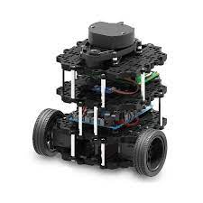

# Turtlebot3-Lidar


* Dockerhub image https://hub.docker.com/r/cognimbus/turtlebot3-wafflepi
* Supported architectures <b>arm64</b>
* ROS version <b>
</b>

# Short description
* Standard lds-01-lidar
License: Apache 2.0
Source: git https://github.com/ROBOTIS-GIT/hls_lfcd_lds_driver.git

# Example usage
```
docker run -it --network=host cognimbus/turtlebot3-wafflepi roslaunch turtlebot3_bringup turtlebot3_lidar.launch set_frame_id:=laser --screen
```

# Subscribers
This node has no subscribers


# Publishers
ROS topic | type
--- | ---
/scan | sensor_msgs/LaserScan


# Required tf
This node does not require tf


# Provided tf
This node does not provide tf


# Turtlebot3-Picamera


* Dockerhub image https://hub.docker.com/r/cognimbus/turtlebot3-wafflepi
* Supported architectures <b>arm64</b>
* ROS version <b>
</b>

# Short description
* raspicamera driver
License: Apache 2.0

# Example usage
```
docker run -it --network=host --privileged cognimbus/turtlebot3-wafflepi roslaunch turtlebot3_bringup turtlebot3_rpicamera.launch
```

# Subscribers
This node has no subscribers


# Publishers
ROS topic | type
--- | ---
/image_raw/compressed | sensor_msgs/CompressedImage
/usb_cam/image_raw | sensor_msgs/Image


# Required tf
This node does not require tf


# Provided tf
This node does not provide tf


# Turtlebot3-Driver



* Dockerhub image https://hub.docker.com/r/cognimbus/turtlebot3-wafflepi
* Supported architectures <b>arm64</b>
* ROS version <b>
</b>

# Short description
* turtlebot3-wafflepi-driver
License: Apache 2.0
Source: git https://github.com/ROBOTIS-GIT/turtlebot3.git

# Example usage
```
docker run -it --network=host cognimbus/turtlebot3-wafflepi roslaunch turtlebot3_bringup turtlebot3_core.launch
```

# Subscribers
ROS topic | type
--- | ---
/cmd_vel | geometry_msgs/Twist


# Publishers
ROS topic | type
--- | ---
/odom | nav_msgs/Odometry


# Required tf
This node does not require tf


# Provided tf
This node does not provide tf


# Turtlebot3-Slam


* Dockerhub image https://hub.docker.com/r/cognimbus/turtlebot3-wafflepi
* Supported architectures <b>arm64</b>
* ROS version <b>
</b>

# Short description
* turtlebot3 gmapping algorithm.
License: Apache 2.0

# Example usage
```
docker run -it --network=host cognimbus/turtlebot3-wafflepi roslaunch turtlebot3_slam turtlebot3_gmapping.launch model:=waffle_pi --screen
```

# Subscribers
ROS topic | type
--- | ---
/scan | sensor_msgs/LaserScan


# Publishers
ROS topic | type
--- | ---
/map | nav_msgs/OccupancyGrid


# Required tf
odom--->base_footprint


# Provided tf
map--->base_footprint
map--->odom


# Turtlebot3-Navigation


* Dockerhub image https://hub.docker.com/r/cognimbus/turtlebot3-wafflepi
* Supported architectures <b>arm64</b>
* ROS version <b>
</b>

# Short description
* The turtlebot3_navigation provides roslaunch scripts for starting the navigation.
License: Apache 2.0
Source: git https://github.com/ROBOTIS-GIT/turtlebot3.git

# Example usage
```
docker run -it --network=host cognimbus/turtlebot3-wafflepi roslaunch turtlebot3_navigation move_base.launch model:=waffle_pi --screen
```

# Subscribers
ROS topic | type
--- | ---
/move_base_simple/goal | geometry_msgs/PoseStamped
/map | nav_msgs/OccupancyGrid
scan | sensor_msgs/LaserScan
odom | nav_msgs/Odometry


# Publishers
ROS topic | type
--- | ---
/cmd_vel | geometry_msgs/Twist
/move_base/status | actionlib_msgs/GoalStatusArray


# Required tf
odom--->base_footprint
map--->odom


# Provided tf
This node does not provide tf


