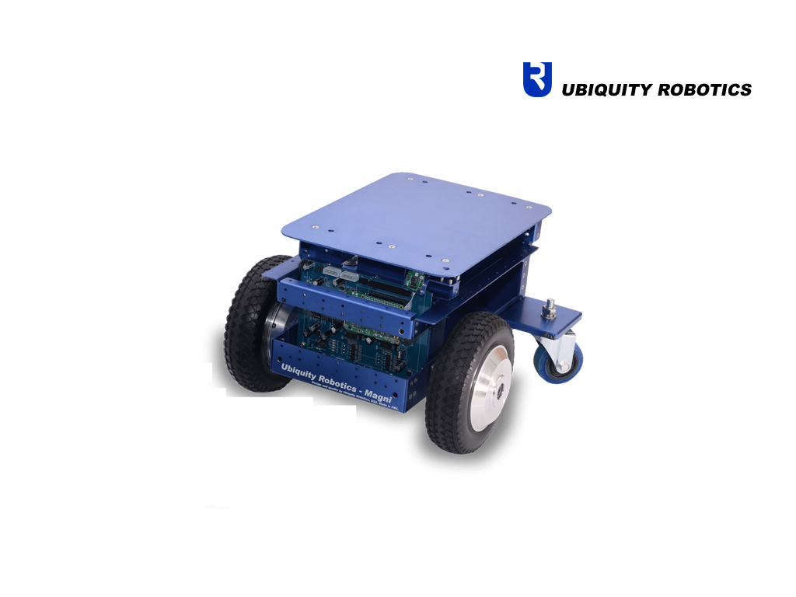

# Magni-Driver



* Dockerhub image https://hub.docker.com/r/cognimbus/ubiquity-driver
* Supported architectures <b>amd64/arm64</b>
* ROS version <b>latest
</b>

# Short description
* Driver for magni silver robot (Ubiquity Robotic’s)

# Example usage
```
docker run -it --network=host --privileged cognimbus/ubiquity-driver roslaunch magni_bringup core.launch controller_serial_port:=/dev/ttyUSB0
```

# Subscribers
ROS topic | type
--- | ---
/cmd_vel | geometry_msgs/Twist


# Publishers
ROS topic | type
--- | ---
/odom | nav_msgs/Odometry
/battery_state | sensor_msgs/BatteryState


# Required tf
This node does not require tf


# Provided tf
odom--->base_footprint
odom--->base_link


