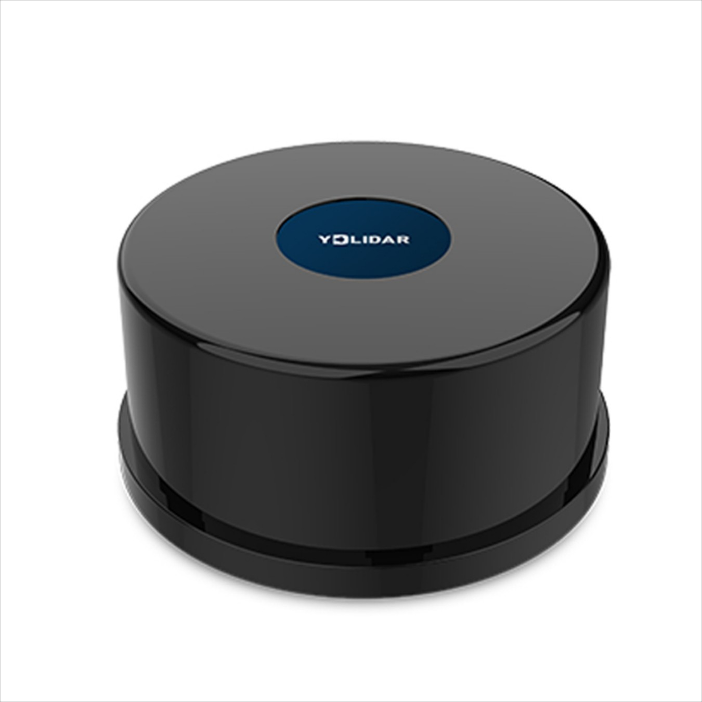

# Ydlidar-Tg30



* Dockerhub image https://hub.docker.com/r/cognimbus/ydlidar-tg30-driver
* Supported architectures <b>arm64/amd64</b>
* ROS version <b>melodic
</b>

# Short description
* ROS support for ydlidar-tg30.
License: MIT
Source: https://github.com/YDLIDAR/ydlidar_ros

# Example usage
```
docker run -it --network=host cognimbus/ydlidar-tg30-driver roslaunch ydlidar_ros TG.launch frame_id:=laser
```

# Subscribers
This node has no subscribers


# Publishers
ROS topic | type
--- | ---
/scan | sensor_msgs/LaserScan


# Required tf
This node does not require tf


# Provided tf
This node does not provide tf


