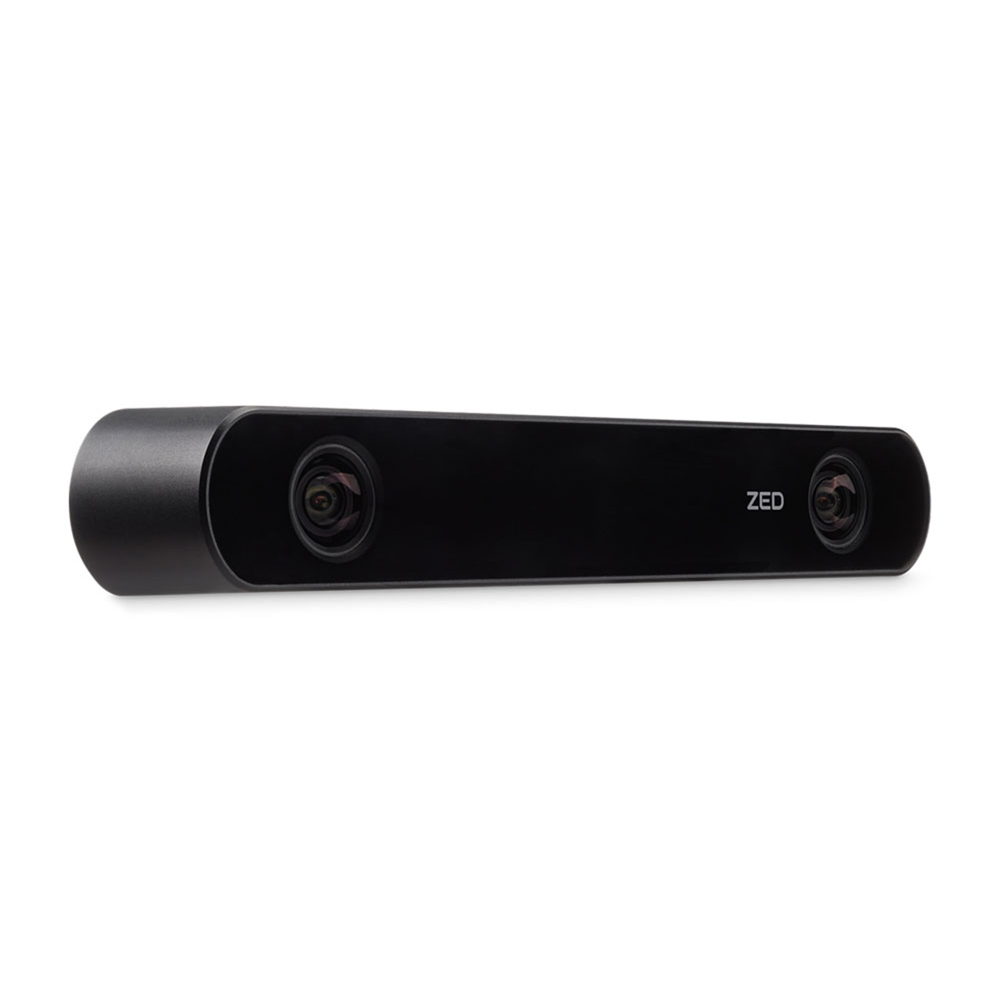

# Zed-Camera-Jetson-Xavier



* Dockerhub image https://hub.docker.com/r/cognimbus/zed-camera-jetson-xavier
* Supported architectures <b>arm64/amd64</b>
* ROS version <b>
</b>

# Short description
* Camera dirver with cuda for zed camera (stereolabs) running on jetson xavier
License: MIT
Source: https://github.com/stereolabs/zed-ros-wrapper

# Example usage
```
docker run -it --network=host --privileged cognimbus/zed-camera-jetson-xavier roslaunch zed_wrapper zed.launch svo_file:= stream:= node_name:=zed_node camera_model:=zed base_frame:=base_link publish_urdf:=true cam_pos_x:=0 cam_pos_y:=0 cam_pos_z:=0 cam_roll:=0 cam_pitch:=0 cam_yaw:=0
```

# Subscribers
This node has no subscribers


# Publishers
ROS topic | type
--- | ---
/zed/zed_node/left/image_rect_color | sensor_msgs/Image
/zed/zed_node/left/image_rect_color/compressed | sensor_msgs/CompressedImage
/zed/zed_node/depth/camera_info | sensor_msgs/CameraInfo
/zed/zed_node/disparity/disparity_image | sensor_msgs/Image
/zed/zed_node/depth/depth_registered | sensor_msgs/Image


# Required tf
This node does not require tf


# Provided tf
This node does not provide tf


